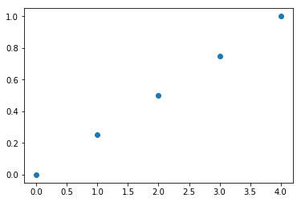

# Python - Numpy 이용하기

- 작성일: 2019. 05. 18.
- 작성자: 김지형 (100kimch@naver.com)

## 모듈에 대한 이해

### 스크립트 (Script)


- 프로그램이 길어지면 파이썬 인터프리터 대화창에서 코드 작성하는 것이 유지, 수정 측면에서 힘들다.
- 인터프리터 창이 아닌 편집기(VS Code, 메모장 등)를 이용해 .py 파일로 코딩한 후에 그 파일을 실행하는 것이 좋은데, 이렇게 하는 것을 "스크립트를 만든다"라고 한다.

### 모듈 (Module)

- 스크립트 유지를 쉽게 하려고 여러 개의 파일로 나누거나, 여러 프로그램에서 썼던 편리한 함수를 각 프로그램에 사용하고 싶을 수 있다. 이를 위해 파이썬은 정의들을 파일에 넣고 스크립트나 인터프리터의 대화형 모드에서 사용할 수 있는 방법을 제공하는데, 그런 파일을 모듈이라고 한다.

#### 인터프리터 대화창에서 "Hello World!" 출력하기

1. cmd, powershell 등 python 실행가능한 콘솔창에서 'python' 또는 'py'를 친다.

1. 다음 코드를 작성한다.

   ```python
   >>> print("Hello World!")
   >>> exit() # Python Interpreter를 종료
   ```

> \>\>\> 는 파이썬 인터프리터 대화창을 의미한다.

#### 모듈을 작성하여 "Hello World!" 출력하기

1. 메모장(또는 다른 코드편집기)을 열고 다음을 친다.

   ```python
   def sayHello():
       print("Hello World!")
   ```

1. C:\hello.py로 저장한다.
1. cmd, powershell 등 python 실행가능한 콘솔창에서 'python' 또는 'py'를 친다.
1. 다음 코드를 작성한다.

   ```python
   >>> import hello
   >>> hello.sayHello()
   ```

1. hello.sayHello()가 아닌 전역에서, 즉 sayHello()로 실행시키키고 싶다면 다음과 같이 코드를 작성한다.

   ```python
   >>> from hello import sayHello
   >>> sayHello()
   ```

1. 모듈의 이름을 바꾸고 싶다면 다음과 같이 코드를 작성한다.

   ```python
   >>> import hello as bot
   >>> bot.sayHello()
   ```

### 패키지 (Package)

- 모듈이 많아지면 모듈 간 이름이 중복되어 충돌이 일어날 수 있는데, "점으로 구분된 모듈 이름"을 써서 이름 중복을 방지할 수 있는데, 이를 패키지라고 한다.
- 여러 개의 모듈을 하나로 묶어놓은 것이다.
- 패키지 사용자는 다음과 같이 패키지로부터 개별 모듈을 임포트할 수 있다.

  ```python
  import sound.effects.echo # echo라는 서브 모듈 호출
  from sound.effects import echo # 전역으로 echo 호출
  ```

## NumPy

### 개요

- Numarray와 Numeric이라는 오래된 패키지를 계승해서 나온 수학 및 과학 연산을 위한 파이썬 패키지
- Py는 파이썬을 나타내기 때문에 "넘파이"라고 읽는다.
- Numpy는 다음과 같은 특징을 갖는다:
  - 강력한 N차원 배열 객체
  - 정교한 브로드캐스팅(Broadcasting) 기능
  - C/C++ 및 포트란 코드 통합 도구
  - 유용한 선형대수, 푸리에 변환 및 난수 기능
  - 범용적 데이터 처리에 사용 가능한 다차원 컨테이너
- NumPy를 사용하기 위해 다음과 같이 numpy 모듈을 "np"로 임포트하여 사용한다.

  ```python
  >>> import numpy as np
  ```

- NumPy의 라이브러리 버전은 다음과 같이 확인할 수 있다.

  ```python
  >>> np.__version__
  ```

#### Numpy 출력 코드

- 결과값을 쉽게 확인하기 위해 앞으로 다음 함수를 작성하여 사용한다.

  ```python
  def pprint(arr):
      print("type:{}".format(type(arr)))
      print("shape: {}, dimension: {}, dtype:{}".format(arr.shape, arr.ndim, arr.dtype))
      print("Array's Data:\n", arr)
  ```

### NumPy 배열

- NumPy 배열은 numpy.ndarray 객체에 정의되어 있다. NumPy 배열(numpy.ndarray 객체) 생성 방법을 소개한다.

#### 파이썬 배열로 NumPy 배열 생성

- 파이썬 배열을 인자로 NumPy 배열을 생성할 수 있다. 파라미터로 list 객체와 데이터타입(dtype)을 입력하여 NumPy 배열을 생성한다. dtype를 생략할 경우, 입력된 list 객체의 요소 타입이 설정된다.

##### [실습 01] NumPy 배열 생성

1. 1차원 배열(list)로 NumPy 배열 생성

   ```python
   >>> arr = [1, 2, 3]
   >>> a = np.array([1, 2, 3])
   >>> pprint(a)
   ```

   ```text
   type:<class 'numpy.ndarray'>
   shape: (3,), dimension: 1, dtype:int64
   Array's Data:
   [1 2 3]
   ```

1. 2차원 배열로 NumPy 배열 생성, 원소 데이터타입 지정

   ```python
   >>> arr = [(1, 2, 3), (4, 5, 6)]
   >>> a = np.array(arr, dtype = float)
   >>> pprint(a)
   ```

   ```text
   type:<class 'numpy.ndarray'>
   shape: (2, 3), dimension: 2, dtype:float64
   Array's Data:
   [[ 1.  2.  3.]
   [ 4.  5.  6.]]
   ```

1. 3차원 배열로 NumPy 배열 생성, 원소 데이터타입 지정

   ```python
   >>> arr = np.array([[[1,2,3], [4,5,6]], [[3,2,1], [4,5,6]]], dtype = float)
   >>> a= np.array(arr, dtype = float)
   >>> pprint(a)
   ```

   ```text
   type:<class 'numpy.ndarray'>
   shape: (2, 2, 3), dimension: 3, dtype:float64
   Array's Data:
   [[[ 1.  2.  3.]
   [ 4.  5.  6.]]

   [[ 3.  2.  1.]
   [ 4.  5.  6.]]]
   ```

#### 배열 생성 및 초기화

- NumPy는 원하는 shape로 배열을 설정하고, 각 요소를 특정 값으로 초기화하는 zeros, ones, full, eye 함수를 제공한다.
- 또한 파라미터로 입력한 배열과 같은 shape의 배열을 만드는 zeros_like, ones_like, full_like 함수도 제공한다. 이 함수를 이용하여 배열을 생성하고 초기화할 수 있다.

##### [실습 02] zeros, ones, full, eye 함수 이용

1. np.zeros()

   ```python
   np.zeros(shape, dtype=float, order='C')
   ```

   - 지정된 shape의 배열을 생성하고, 모든 요소를 0으로 초기화

   ```python
   >>> a = np.zeros((3, 4))
   >>> pprint(a)
   ```

   ```text
   type:<class 'numpy.ndarray'>
   shape: (3, 4), dimension: 2, dtype:float64
   Array's Data:
   [[ 0.  0.  0.  0.]
   [ 0.  0.  0.  0.]
   [ 0.  0.  0.  0.]]
   ```

1. np.ones()

   ```python
   np.ones(shape, dtype=None, order='C')
   ```

   - 지정된 shape의 배열을 생성하고, 모든 요소를 1로 초기화

   ```python
   >>> a = np.ones((2,3,4),dtype=np.int16)
   >>> pprint(a)
   ```

   ```text
   type:<class 'numpy.ndarray'>
   shape: (2, 3, 4), dimension: 3, dtype:int16
   Array's Data:
   [[[1 1 1 1]
   [1 1 1 1]
   [1 1 1 1]]

   [[1 1 1 1]
   [1 1 1 1]
   [1 1 1 1]]]
   ```

1. np.full()

   ```python
   np.full(shape, fill_value, dtype=None, order='C')
   ```

   - 지정된 shape의 배열을 생성하고, 모든 요소를 지정한 "fill_value"로 초기화

   ```python
   >>> a = np.full((2, 2), 7)
   >>> pprint(a)
   ```

   ```text
   type:<class 'numpy.ndarray'>
   shape: (2, 2), dimension: 2, dtype:int64
   Array's Data:
   [[7 7]
   [7 7]]
   ```

1. np.eye()

   ```python
   np.eye(N, M=None, k=0, dtype=<class 'float'>)
   ```

   - (N, N) shape의 단위 행렬(Unit Matrix)을 생성

   ```python
   >>> np.eye(4)
   ```

   ```text
   array([[ 1.,  0.,  0.,  0.],
    [ 0.,  1.,  0.,  0.],
    [ 0.,  0.,  1.,  0.],
    [ 0.,  0.,  0.,  1.]])
   ```

##### [실습 03] empty, like 함수 이용

1. np.empty()

   ```python
   np.empty(shape, dtype=float, order='C')
   ```

   - 지정된 shape의 배열 생성
   - 요소의 초기화 과정에 없고, 기존 메모리값을 그대로 사용
   - 배열 생성비용이 가장 저렴하고 빠름
   - 배열 사용 시 주의가 필요(초기화를 고려)

   ```python
   >>> a = np.empty((4, 2))
   >>> pprint(a)
   ```

   ```text
   type:<class 'numpy.ndarray'>
   shape: (4, 2), dimension: 2, dtype:float64
   Array's Data:
   [[  0.00000000e+000   6.91240343e-310]
   [  6.91240500e-310   5.39088070e-317]
   [  5.39084907e-317   6.91239798e-310]
   [  3.16202013e-322   6.91239798e-310]]
   ```

1. like 계열 함수

   - numpy는 지정된 배열과 shape이 같은 행렬을 만드는 like 함수를 제공한다.
     - np.zeros_like()
     - np.ones_like()
     - np.full_like()
     - np.empty_like()

   ```python
   a = np.array([[1,2,3], [4,5,6]])
   b = np.ones_like(a)
   pprint(b)
   ```

   ```text
   type:<class 'numpy.ndarray'>
   shape: (2, 3), dimension: 2, dtype:int64
   Array's Data:
   [[1 1 1]
   [1 1 1]]
   ```

#### 데이터 생성 함수

- NumPy는 다음과 같이 주어진 조건으로 데이터를 생성한 후, 배열을 만드는 데이터 생성 함수를 제공한다.
  - np.linspace()
  - np.arange()
  - np.logspace()

##### [실습 04] linspace, arange, logspace 함수 이용

1. np.linspace()

   ```python
   np.linspace(start, stop, num=50, endpoint=True, retstep=False, dtype=None)
   ```

   - start부터 stop의 범위에서 num개를 균일한 간격으로 데이터를 생성하고 배열을 만드는 함수
   - 요소 개수를 기준으로 균등 간격의 배열을 생성

   ```python
   >>> a = np.linspace(0, 1, 5)
   >>> pprint(a)
   ```

   ```text
   type:<class 'numpy.ndarray'>
   shape: (5,), dimension: 1, dtype:float64
   Array's Data:
   [ 0.    0.25  0.5   0.75  1.  ]
   ```

   ```python
   # linspace의 데이터 추출 시각화
   import matplotlib.pyplot as plt
   plt.plot(a, 'o')
   plt.show()
   ```

   - 

1. np.arange()

   ```python
   np.arange([start,] stop[, step,], dtype=None)
   ```

   - start부터 stop 미만까지 step 간격으로 데이터 생성한 후 배열을 만듦
   - 범위내에서 간격을 기준 균등 간격의 배열
   - 요소의 객수가 아닌 데이터의 간격을 기준으로 배열 생성

   ```python
   >>> a = np.arange(0, 10, 2, np.float)
   >>> pprint(a)
   ```

   ```text
   type:<class 'numpy.ndarray'>
   shape: (5,), dimension: 1, dtype:float64
   Array's Data:
   [ 0.  2.  4.  6.  8.]
   ```

   ```python
   # arange의 데이터 추출 시각화
   >>> import matplotlib.pyplot as plt
   >>> plt.plot(a, 'o')
   >>> plt.show()
   ```

   

1. np.logspace()

   ```python
   np.logspace(start, stop, num=50, endpoint=True, base=10.0, dtype=None)
   ```

   - 로그 스케일의 linspace 함수
   - 로그 스케일로 지정된 범위에서 num 개수만큼 균등 간격으로 데이터 생성한 후 배열 만듦

   ```python
   >>> a = np.logspace(0.1, 1, 20, endpoint=True)
   >>> pprint(a)
   ```

   ```text
   type:<class 'numpy.ndarray'>
   shape: (20,), dimension: 1, dtype:float64
   Array's Data:
   [  1.25892541   1.40400425   1.565802     1.74624535   1.94748304
   2.1719114    2.42220294   2.70133812   3.0126409    3.35981829
   3.74700446   4.17881006   4.66037703   5.19743987   5.79639395
   6.46437163   7.2093272    8.04013161   8.9666781   10.        ]
   ```

   ```python
   # logspace의 데이터 추출 시각화
   import matplotlib.pyplot as plt
   plt.plot(a, 'o')
   plt.show()
   ```

   - 

#### 난수 기반 배열 생성

- NumPy는 난수 발생 및 배열 생성을 생성하는 numpy.random 모듈을 제공한다.
- numpy.random 모듈은 다음과 같은 함수를 제공한다:
  - np.random.normal()
  - np.random.rand()
  - np.random.randn()
  - np.random.randint()
  - np.random.random()

##### [실습 05] np.random.normal 함수 이용

1. np.random.normal()

   ```python
   np.random.normal(loc=0.0, scale=1.0, size=None)
   ```

   - 정규 분포 확률 밀도에서 표본 추출
   - loc: 정규 분포의 평균
   - scale: 표준편차

   ```python
   >>> mean = 0
   >>> std = 1
   >>> a = np.random.normal(mean, std, (2, 3))
   >>> pprint(a)
   ```

   ```text
   type:<class 'numpy.ndarray'>
   shape: (2, 3), dimension: 2, dtype:float64
   Array's Data:
   [[ 1.4192442  -2.0771293   1.84898108]
   [-0.12303317  1.04533993  1.94901387]]
   ```

   - np.random.normal이 생성한 난수는 정규 분포의 형상을 갖는다.
   - 다음 예제는 정규 분포로 10000개 표본을 뽑은 결과를 히스토그램으로 표현한 예다.
   - 표본 10000개의 배열을 100개 구간으로 구분할 때, 정규 분포 형태를 보이고 있다.

   ```python
   >>> data = np.random.normal(0, 1, 10000)
   >>> import matplotlib.pyplot as plt
   >>> plt.hist(data, bins=100)
   >>> plt.show()
   ```

   - 

##### [과제 01]

1. 다음 np.random.rand() 레퍼런스를 참고하여 20000개의 표본을 뽑아 50개의 구간으로 구분한 임의 난수 히스토그램을 그리고, 출력 결과를 해석하시오.

   > https://docs.scipy.org/doc/numpy/reference/generated/numpy.random.rand.html

   - 출력 결과
     
   - 해답

   ```python
   data = np.random.rand(20000)
   import matplotlib.pyplot as plt
   plt.hist(data, bins=50)
   plt.show()
   ```

   - 0.0부터 1.0까지 50개의 구간에서 균일한 분포를 보인다. 구간별 약 20000 / 50 = 400 개의 표본이 존재한다.

1. 다음 np.random.randint() 레퍼런스를 참고하여 0에서 5까지의 5x5 정수 임의 배열을 생성하시오. 꼬한 10000개의 표본을 뽑아 임의 난수 히스토그램을 그리고, 출력 결과를 해석하시오.

   > https://docs.scipy.org/doc/numpy/reference/generated/numpy.random.randint.html

### NumPy 입출력

- Numpy는 배열 객체를 바이너리 파일 혹은 텍스트 파일에 저장하고 로딩하는 기능을 제공한다.
- 입출력을 위한 함수는 다음과 같다:

| 함수명       | 기능                                 | 파일포맷 |
| ------------ | ------------------------------------ | -------- |
| np.save()    | NumPy 배열 객체 1개를 파일에 저장    | 바이너리 |
| np.savez()   | Numpy 배열 객체 복수개를 파일에 저장 | 바이너리 |
| np.load()    | Numpy 배열 저장 파일로부터 객체 로딩 | 바이너리 |
| np.loadtxt() | 텍스트 파일로부터 배열 로딩          | 텍스트   |
| np.savetxt() | 텍스트 파일에 NumPy 배열 객체 저장   | 텍스트   |

##### [실습 06] 입출력 예제

```python
a = np.random.randint(0, 10, (2, 3))
b = np.random.randint(0, 10, (2, 3))
pprint(a)
pprint(b)
# a 배열 파일에 저장
np.save("./my_array1", a)
# a, b 두 개의 배열을 파일에 저장
np.savez("my_array2", a, b);
# 1개 배열 로딩
np.load("./my_array1.npy")
# 복수 파일 로딩
npzfiles = np.load("./my_array2.npz")
npzfiles.files
npzfiles['arr_0']
npzfiles['arr_1']
```

```text
type:<class 'numpy.ndarray'>
shape: (2, 3), dimension: 2, dtype:int64
Array's Data:
[[8 7 4]
[4 3 8]]
type:<class 'numpy.ndarray'>
shape: (2, 3), dimension: 2, dtype:int64
Array's Data:
[[6 9 8]
[9 7 7]]
array([[8, 7, 4],
[4, 3, 8]])
['arr_0', 'arr_1']
array([[8, 7, 4],
[4, 3, 8]])
array([[6, 9, 8],
[9, 7, 7]])
```

### 데이터 타입

- NumPy는 다음과 같은 데이터 타입을 지원한다. 배열을 생성할 때 dtype속성으로 다음과 같은 데이터 타입을 지정할 수 있다.
  - np.int64 : 64 비트 정수 타입
  - np.float32 : 32 비트 부동 소수 타입
  - np.complex : 복소수 (128 float)
  - np.bool : 불린 타입 (True, False)
  - np.object : 파이썬 객체 타입
  - np.string\_ : 고정자리 스트링 타입
  - np.unicode\_ : 고정자리 유니코드 타입

### 배열 상태 검사 (Inspecting)

- NumPy는 배열의 상태를 검사하는 다음과 같은 방법을 제공한다.

| 배열 속성 검사 항목 | 배열 속성 확인 방법        | 예시               | 결과             |
| ------------------- | -------------------------- | ------------------ | ---------------- |
| 배열 shape          | np.ndarray.shape 속성      | arr.shape          | (5, 2, 3)        |
| 배열 길이           | 일차원의 배열 길이 확인    | len(arr)           | 5                |
| 배열 차원           | np.ndarray.ndim 속성       | arr.ndim           | 3                |
| 배열 요소 수        | np.ndarray.size 속성       | arr.size           | 30               |
| 배열 타입           | np.ndarray.dtype 속성      | arr.dtype          | dtype(‘float64’) |
| 배열 타입 명        | np.ndarray.dtype.name 속성 | arr.dtype.name     | float64          |
| 배열 타입 변환      | np.ndarray.astype 함수     | arr.astype(np.int) | 배열 타입 변환   |

##### [실습 07] 배열 속성 검사 항목 예제

- NumPy 배열 객체는 다음과 같은 방식으로 속성을 확인할 수 있다.

  ```python
  # 데모 배열 객체 생성
  arr = np.random.random((5, 2, 3))
  # 배열 타입 조회
  type(arr)
  # 배열의 shape 확인
  arr.shape
  # 배열의 길이
  len(arr)
  # 배열의 차원 수
  arr.ndim
  # 배열의 요소 수: shape(k, m, n) ==> k*m*n
  arr.size
  # 배열 타입 확인
  arr.dtype
  # 배열 타입 명
  arr.dtype.name
  # 배열 요소를 int로 변환
  # 요소의 실제 값이 변환되는 것이 아님
  # View의 출력 타입과 연산을 변환하는 것
  arr.astype(np.int)
  # np.float으로 타입을 다시 변환하면 np.int 변환 이전 값으로 모든 원소 값이 복원됨
  arr.astype(np.float)
  ```

  ```text
  numpy.ndarray
  (5, 2, 3)
  5
  3
  30
  dtype('float64')
  'float64'

  array([[[0, 0, 0],
   [0, 0, 0]],

   [[0, 0, 0],
   [0, 0, 0]],

   [[0, 0, 0],
   [0, 0, 0]],

   [[0, 0, 0],
   [0, 0, 0]],

   [[0, 0, 0],
   [0, 0, 0]]])

   array([[[ 0.16384724,  0.14102935,  0.13880948],
   [ 0.75155573,  0.41813362,  0.32200517]],

   [[ 0.15771594,  0.15517552,  0.73518959],
   [ 0.45756098,  0.47543577,  0.5771006 ]],

   [[ 0.21845306,  0.10044739,  0.63770484],
   [ 0.36300707,  0.67294698,  0.9287396 ]],

   [[ 0.17435257,  0.90261209,  0.16389656],
   [ 0.8118577 ,  0.36231545,  0.26170523]],

   [[ 0.41849605,  0.44730829,  0.03815196],
   [ 0.03938546,  0.45850899,  0.15059227]]])
  ```

##### [과제 02]

1. 0부터 30까지 임의 실수의 난수를 생성하는 5x5 배열을 assignment2.npy에 저장하고, getArray("assignment2.npy") 호출 시 다음과 같이 출력하는 함수 getArray를 작성하시오.

   ```python
   def getArrray(filename)
   ```

   - 입력: [str] .npy 형식 파일명
   - 출력:

   ```text
   -------- 배열 정보 --------
    타입: ndarray
    길이: 5
    요소 수: 25
    배열 타입: int64
   -------------------------
   array([[17, 29, 15, 10, 27],
       [18, 12,  2, 10, 26],
       [29,  5, 12, 17, 10],
       [ 8, 16, 25, 26, 10],
       [18, 29, 26, 19, 13]])
   ```

   - 조건

     - 저장된 Array는 Return 하시오.

   - 해답

   ```python
   np.save("./assignment2", np.random.randint(0, 30, (5, 5)))
   def getArray(filename):
      arr = np.load(filename)
      print("-------- 배열 정보 --------")
      print(" 타입: " + type(arr).__name__)
      print(" 길이: " + str(len(arr)))
      print(" 요소 수: " + str(arr.size))
      print(" 배열 타입: " + str(arr.dtype.name))
      print("-------------------------")
      return arr

   getArray("assignment2.npy")
   ```

1. np.random.random()을 이용하여 4x4 배열을 생성하고, 1번 getArray()함수를 이용하여 배열 정보를 출력하시오. 그리고 배열의 모든 값에 100을 곱해주고, np.int형으로 변환한 뒤 배열 정보와 값을 확인하시오.

   - 해답

   ```python
   np.save("./assignment2_2", np.random.random((4, 4)))
   arr = getArray("assignment2_2.npy")
   np.save("./assignment2_2", arr*100)
   getArray("assignment2_2.npy")
   ```

### 도움말

- NumPy의 모든 API는 np.info 함수를 이용하여 도움말을 확인할 수 있다.

##### [실습 08] 도움말 예제

```python
np.info(np.ndarray.dtype)
```

```text
Data-type of the array's elements.

Parameters
----------
None

Returns
-------
d : numpy dtype object

See Also
--------
numpy.dtype

Examples
--------
>>> x
array([[0, 1],
   [2, 3]])
>>> x.dtype
dtype('int32')
>>> type(x.dtype)
<type 'numpy.dtype'>
```

```python
np.info(np.squeeze)
```

```text
squeeze(a, axis=None)

Remove single-dimensional entries from the shape of an array.

Parameters
----------
a : array_like
  Input data.
axis : None or int or tuple of ints, optional
  .. versionadded:: 1.7.0

...skipped
```

#### 개요

1. 산술 연산
1. 비교 연산
1. 집계 함수
1. 브로드캐스팅
1. 벡터 연산
1. 배열 복사
1. 배열 정렬
1. 서브셋, 슬라이싱, 인덱싱
1. 배열 변환
1. 배열 결합
1. 배열 분리

### 배열 일반 연산

- NumPy는 기본 연산자를 연산자 재정의하여 배열(행렬) 연산에 대한 직관적으로 표현을 강화하였다. 모든 산술 연산 함수는 np 모듈에 포함되어 있다.
- 산술 연산
  - 배열의 덧셈, 뺄셈, 곱셈, 나눗셈, 사인, 코사인 등 다양한 산술연산을 할 수 있다.
- 비교 연산
  - 배열의 요소별 비교 (Element-wise): a == b, a > b 등 요소별비교 연산을 할 수 있다.
  - 배열 비교 (Array-wise): 두 배열 전체를 비교할 수 있다.

##### [실습 09] 산술 연산 / 비교 연산

```python
# arange로 1부터 10 미만의 범위에서 1씩 증가하는 배열 생성
# 배열의 shape를 (3, 4)으로 지정
a = np.arange(1, 10).reshape(3, 3)
pprint(a)
```

```text
shape: (3, 3), dimension: 2, dtype:int64
Array's Data
[[1 2 3]
[4 5 6]
[7 8 9]]
```

- 배열 일반 연산

  ```python
  # arange로 9부터 0까지 범위에서 1씩 감소하는 배열 생성
  # 배열의 shape을 (3, 3)으로 지정
  b = np.arange(9, 0, -1).reshape(3, 3)
  pprint(b)
  ```

  ```text
  shape: (3, 3), dimension: 2, dtype:int64
  Array's Data
  [[9 8 7]
  [6 5 4]
  [3 2 1]]
  ```

- 배열 산술 연산

  ```python
  # 배열 연산: -, +, /, *
  >>> a - b
  >>> np.subtract(a, b)
  >>> a + b
  >>> np.add(a, b)
  >>> a / b
  >>> np.divide(a, b)
  >>> a * b
  >>> np.multiply(a, b)
  # 배열 연산: 지수, 제곱근, sin, cos, tan, log, 내적
  >>> np.exp(b)
  >>> np.sqrt(a)
  >>> np.sin(a)
  >>> np.cos(a)
  >>> np.tan(a)
  >>> np.log(a)
  >>> np.dot(a, b)
  ```

- 배열의 요소별 비교

  ```python
  >>> a == b
  >>> a > b
  ```

  ```text
  array([[False, False, False],
    [False,  True, False],
    [False, False, False]], dtype=bool)
  array([[False, False, False],
    [False, False,  True],
    [ True,  True,  True]], dtype=bool)
  ```

- 배열 비교

  ```python
  np.array_equal(a, b)
  ```

  ```text
  False
  ```

### 집계 함수 (Aggregate Functions)

- NumPy의 모든 집계 함수는 집계 함수는 AXIS를 기준으로 계산된다. 집계함수에 AXIS를 지정하지 않으면 axis=None이다. axis=None, 0, 1은 다음과 같은 기준으로 생각할 수 있다.
- 
- axis=None
  - axis=None은 전체 행렬을 하나의 배열로 간주하고 집계 함수의 범위를 전체 행렬로 정의한다.
- 
- axis=0
  - axis=0은 행을 기준으로 각 행의 동일 인덱스의 요소를 그룹으로 합니다. - 각 그룹을 집계 함수의 범위로 정의한다.
- 
- axis=1
  - axis=1은 열을 기준으로 각 열의 요소를 그룹으로 한다.
  - 각 그룹을 집계 함수의 범위로 정의한다.
- axis 관련해서는 Numpy에서 np.sum 함수의 axis 이해(http://taewan.kim/post/numpy_sum_axis/)를 참조.

##### [실습 10] 집계 함수

- [ndarray 배열 객체].sum(), np.sum(): 합계
- [ndarray 배열 객체].min(), np.min(): 최소값
- [ndarray 배열 객체].max(), np.max(): 최대값
- [ndarray 배열 객체].cumssum(), np.cumsum(): 누적 합계
- [ndarray 배열 객체].mean(), np.mean(): 평균
- np.median(): 중앙값
- np.corrcoef(): (상관계수)Correlation coeficient
- [ndarray 배열 객체].std(), np.std(): 표준편차

```python
# arange로 1부터 10미만의 범위에서 1씩 증가하는 배열 생성
# 배열의 shape을 (3, 3)으로 지정
a = np.arange(1, 10).reshape(3, 3)
pprint(a)
```

```text
shape: (3, 3), dimension: 2, dtype:int64
Array's Data
[[1 2 3]
[4 5 6]
[7 8 9]]
```

```python
>>> a.sum(), np.sum(a)
>>> a.sum(axis=0), np.sum(a, axis=0)
>>> a.sum(axis=1), np.sum(a, axis=1)
>>> a.min(), a.min(axis=0), a.min(axis=1)
>>> np.max(a, axis=0), np.max(a, axis=1)
>>> a.cumsum(axis=1), np.cumsum(a, axis=1)
>>> np.correof(a)
>>> a.std()
```

##### [과제 03]

1. arange로 9부터 0까지 범위에서 1씩 감소하는 배열 생성하고, 배열의 shape를 (3, 3)으로 지정하시오.
1. np.random.normal()을 이용하여 4x4 배열을 생성하고, axis=0과 axis=1일 때의 표준편차를 계산하시오.
1. np.random.random()을 이용하여 3x3 배열을 3개 생성하고, 3개 배열의 각 항을 더한 뒤 중앙값을 반환하시오.

### 브로드캐스팅


- Shape이 같은 두 배열에 대한 이항 연산은 배열의 요소별로 수행된다. 두 배열 간의 Shape이 다를 경우 두 배열 간의 형상을 맞추는 <그림 2>의 Broadcasting 과정을 거친다.
- 참조: https://mathematica.stackexchange.com/questions/99171/how-to-implement-the-gene
- Shape가 같은 배열의 이항연산
  - Shape이 같은 두 배열을 이항 연살 할 경우 위치가 같은 요소 단위로 수행된다.
- Shape이 다른 두 배열의 연산
  - Shape이 다른 두 배열 사이의 이항 연산에서 브로드케스팅 발생
  - 두 배열을 같은 Shape으로 만든 후 연산을 수행

##### [실습 11] 브로드캐스팅

```python
# 데모 배열 생성
a = np.arange(1, 25).reshape(4, 6)
pprint(a)
b = np.arange(25, 49).reshape(4, 6)
pprint(b)
```

```text
shape: (4, 6), dimension: 2, dtype:int64
Array's Data
[[ 1  2  3  4  5  6]
[ 7  8  9 10 11 12]
[13 14 15 16 17 18]
[19 20 21 22 23 24]]
shape: (4, 6), dimension: 2, dtype:int64
Array's Data
[[25 26 27 28 29 30]
[31 32 33 34 35 36]
[37 38 39 40 41 42]
[43 44 45 46 47 48]]
```

- Shape가 같은 배열의 이항연산

  ```python
  # Shape가 같은 배열의 이항연산
  a = np.arange(1, 25).reshape(4, 6)
  pprint(a)
  b = np.arange(25, 49).reshape(4, 6)
  pprint(b)
  # 이항 연산
  a + b
  ```

- Shape가 다른 두 배열의 연산(1): 배열과 스칼라

  ```python
  # Shape가 다른 두 배열의 연산(1): 배열과 스칼라
  a = np.arange(1, 25).reshape(4, 6)
  pprint(a)
  a+100
  ```

- Shape가 다른 배열들의 연산

  ```python
  # Shape가 다른 배열들의 연산
  a = np.arange(5).reshape((1, 5))
  pprint(a)
  b = np.arange(5).reshape((5, 1))
  pprint(b)
  a+b
  ```

### 벡터 연산

- NumPy는 벡터 연산을 지원한다. NumPy의 집합 연산에는 Vectorization이 적용되어 있다. 배열 처리에 대한 벡터 연산을 적용할 경우 처리 속도가 100배 이상 향상된다. 머신러닝에서 선형대수 연산을 처리할 때 매우 높은 효과가 있을 수 있다.
- 아래 테스트에서 천만 개의 요소를 갖는 배열의 요소를 합산하는 코드를 반복문으로 처리하면 2.5초가 소요된다. 이 연산을 벡터 연산으로 처리하면 10밀리세컨드로 단축된다.

  ```python
  import numpy as np
  # sample array
  a = np.arange(10000000)

  # loop문을 이용한 연산 처리: 2.7초
  result = 0
  %%time
  for v in a:
     result += v
  result
  ```

  ```text
  CPU times: user 2.57 s, sys: 0 ns, total: 2.57 s
  Wall time: 2.57 s
  49999995000000
  ```

  ```python
  # numpy의 벡터 연산: 10ms
  %%time
  result = np.sum(a)
  result
  ```

  ```text
  CPU times: user 10 ms, sys: 0 ns, total: 10 ms
  Wall time: 16.3 ms
  49999995000000
  ```

### 배열 복사

- ndarray 배열 객체에 대한 slice, subset, indexing이 반환하는 배열은 새로운 객체가 아닌 기존 배열의 뷰다. 반환한 배열의 값을 변경하면 원본 배열에 반영된다. 따라서 기본 배열로부터 새로운 배열을 생성하기 위해서는 copy 함수로 명시적으로 사용해야 한다. copy 함수로 복사된 원본 배열과 사본 배열은 완전히 다른 별도의 객체다.
- [ndarray 배열 객체].copy(), np.copy()

##### [실습 12][ndarray 배열 객체].copy(), np.copy()

```python
a = np.random.randint(0, 9, (3, 3))
pprint(a)
copied_a1 =np.copy(a)
# 복사된 배열의 요소 업데이트
copied_a1[:, 0]=0 #배열의 전체 row의 첫번째 요소 0으로 업데이트
pprint(copied_a1)
# 복사본 배열 변경이 원보에 영향을 미치지 않음
pprint(a)
#np.copy()를 이용한 복사
copied_a2 = np.copy(a)
pprint(copied_a2)
```

```text
shape: (3, 3), dimension: 2, dtype:int64
Array's Data
[[1 8 2]
[3 1 7]
[2 8 4]]
shape: (3, 3), dimension: 2, dtype:int64
Array's Data
[[0 8 2]
[0 1 7]
[0 8 4]]
shape: (3, 3), dimension: 2, dtype:int64
Array's Data
[[1 8 2]
[3 1 7]
[2 8 4]]
shape: (3, 3), dimension: 2, dtype:int64
Array's Data
[[1 8 2]
[3 1 7]
[2 8 4]]
```

### 배열 정렬

- ndarray 객체는 axis를 기준으로 요소 정렬하는 sort 함수를 제공한다.

##### [실습 14] 배열 정렬

```python
# 배열 생성
unsorted_arr = np.random.random((3, 3))
pprint(unsorted_arr)
# 데모를 위한 배열 복사
unsorted_arr1 = unsorted_arr.copy()
unsorted_arr2 = unsorted_arr.copy()
unsorted_arr3 = unsorted_arr.copy()
```


```python
# 배열 정렬
unsorted_arr1.sort()
pprint(unsorted_arr1)
```


```python
# 배열 정렬, axis=0
unsorted_arr2.sort(axis=0)
pprint(unsorted_arr2)
```


```python
# 배열 정렬, axis=1
unsorted_arr3.sort(axis=1)
pprint(unsorted_arr3)
```

### 서브셋, 슬라이싱, 인덱싱

- 요소 선택

  - 배열의 각 요소는 axis 인덱스 배열로 참조할 수 있다. 1차원 배열은 1개 인덱스, 2차원 배열은 2개 인덱스, 3차원 인덱스는 3개 인덱스로 요소를 참조할 수 있다.
  - 인덱스로 참조한 요소는 값 참조, 값 수정이 모두 가능하다.

    ```python
    # 데모 배열 생성
    a0 = np.arange(24) # 1차원 배열
    pprint(a0)
    a1 = np.arange(24).reshape((4, 6)) #2차원 배열
    pprint(a1)
    a2 = np.arange(24).reshape((2, 4, 3)) # 3차원 배열
    pprint(a2)

    # 1차원 배열 요소 참조 및 변경
    a0[5] # 5번 인덱스 요소 참조
    # 5번 인덱스 요소 업데이트
    a0[5] = 1000000
    pprint(a0)

    # 2차원 배열 요소 참조 및 변경
    pprint(a1)
    # 1행 두번째 컬럼 요소 참조
    a1[0, 1]
    # 1행 두번째 컬럼 요소 업데이트
    a1[0, 1]=10000
    pprint(a1)
    ```

    ```text
    shape: (24,), dimension: 1, dtype:int64
    Array's Data
    [ 0  1  2  3  4  5  6  7  8  9 10 11 12 13 14 15 16 17 18 19 20 21 22 23]
    shape: (4, 6), dimension: 2, dtype:int64
    Array's Data
    [[ 0  1  2  3  4  5]
    [ 6  7  8  9 10 11]
    [12 13 14 15 16 17]
    [18 19 20 21 22 23]]
    shape: (2, 4, 3), dimension: 3, dtype:int64
    Array's Data
    [[[ 0  1  2]
    [ 3  4  5]
    [ 6  7  8]
    [ 9 10 11]]

    [[12 13 14]
    [15 16 17]
    [18 19 20]
    [21 22 23]]]
    shape: (24,), dimension: 1, dtype:int64
    Array's Data
    [      0       1       2       3       4 1000000       6       7       8
        9      10      11      12      13      14      15      16      17
        18      19      20      21      22      23]
    shape: (4, 6), dimension: 2, dtype:int64
    Array's Data
    [[ 0  1  2  3  4  5]
    [ 6  7  8  9 10 11]
    [12 13 14 15 16 17]
    [18 19 20 21 22 23]]
    ```

- 슬라이싱(Slicing)

  - 여러개의 배열 요소를 참조할 때 슬라이싱을 사용한다. 슬라이싱은 from_index : to_index 형태로 지정한다. from_index는 범위의 시작 인덱스이며, to_index는 범위의 종료 인덱스다. 요소 범위를 지정할 때 to_index는 결과에 포함되지 않는다.
  - from_index : to_index의 범위 지정에서 from_index는 생략 가능하다. 생략할 경우 0을 지정한 것으로 간주한다. to_index 역시 생략 가능하다. 이 경우 마지막 인덱스로 설정된다. 따라서 "" 형태로 지정된 범위는 전체 범위를 의미한다.
  - from_index와 to_index에 음수를 지정하면 이것은 반대 방향을 의미한다. 예를 들어서 -1은 마지막 인덱스를 의미한다.
  - 슬라이싱은 원본 배열의 뷰다. 따라서 슬라이싱 결과의 요소를 업데이트하면 원본에 반영된다.

  ```python
  # 데모 배열 생성
  a1 = np.arange(1, 25).reshape((4, 6)) #2차원 배열
  pprint(a1)
  ```

  ```text
  shape: (4, 6), dimension: 2, dtype:int64
  Array's Data
  [[ 1  2  3  4  5  6]
  [ 7  8  9 10 11 12]
  [13 14 15 16 17 18]
  [19 20 21 22 23 24]]
  ```

  - 가운데 요소 가져오기

  ```python
  a1[1:3, 1:5]
  ```

  - 음수 인덱스를 이용한 범위 설정
    - 음수 인덱스는 지정한 axis의 마지막 요소로 부터 반대 방향의 인덱스다.
    - -1은 마지막 요소의 인덱스를 의미한다.
    - 다음 슬라이싱은 위 슬라이싱과 동일한 결과를 만든다.

  ```python
  a1[1:-1, 1:-1]
  ```

- 불린 인덱싱(Boolean Indexing)

  - 배열 각 요소의 선택 여부를 True, False 지정하는 방식이다. 해당 인덱스의 True만을 조회한다.

  ```python
  # 데모 배열 생성
  a1 = np.arange(1, 25).reshape((4, 6)) #2차원 배열
  pprint(a1)

  # 짝수인 요소 확인
  # numpy broadcasting을 이용하여 짝수인 배열 요소 확인
  even_arr = a1%2==0
  pprint(even_arr)

  # a1[a1%2==0] 동일한 의미입니다.
  a1[even_arr]

  np.sum(a1)
  ```

- 팬시 인덱싱 (Fancy Indexing)

  - 배열에 인덱스 배열을 전달하여 요소를 참조하는 방법이다.

  ```python
  arr = np.arange(1, 25).reshape((4, 6))
  pprint(arr)

  # Fancy Case 1
   [arr[0,0], arr[1, 1], arr[2, 2], arr[3, 3]]
   # 두 배열을 전달 ==> (0, 0), (1, 1), (2, 2), (3, 3)
   arr[[0, 1, 2, 3], [0, 1, 2, 3]]

   # Fancy Case 2
   # 전체 행에 대해서 1, 2번 칼럼 참조
   arr[:, [1, 2]]
  ```

  ```text
  shape: (4, 6), dimension: 2, dtype:int64
  Array's Data
  [[ 1  2  3  4  5  6]
  [ 7  8  9 10 11 12]
  [13 14 15 16 17 18]
  [19 20 21 22 23 24]]
  [1, 8, 15, 22]
  array([ 1,  8, 15, 22])
  array([[ 2,  3],
     [ 8,  9],
     [14, 15],
     [20, 21]])
  ```

### 배열 변환

- 배열을 변환하는 방접으로는 전치, 배열 shape 변환, 배열 요소 추가, 배열 결합, 분리 등이 있다. 각 배열 변경 방법에 대하여 살펴본다.

#### 전치 (Transpose)

- Tranpose는 행렬의 인덱스가 바뀌는 변환이다. 행렬의 Tranpose의 예는 다음과 같다.


- 다음은 NumPy에서 행렬을 전치하기 위하여 [numpy.ndarray 객체].T 속성을 사용한다.
- 이 속성은 전치된 행렬을 반환한다.

```python
# 행렬 생성
a = np.random.randint(1, 10, (2, 3))
pprint(a)
pprint(a.T)
```

```text
shape: (2, 3), dimension: 2, dtype:int64
Array's Data
[[6 6 1]
[4 1 3]]
shape: (3, 2), dimension: 2, dtype:int64
Array's Data
[[6 4]
[6 1]
[1 3]]
```

#### 배열 형태 변경

- [numpy.ndarray 객체]는 배열의 Shape을 변경하는 ravel 메서드와 reshape 메서드를 제공한다.
  - ravel은 배열의 shape을 1차원 배열로 만드는 메서드다.
  - reshape은 데이터 변경없이 지정된 shape으로 변환하는 메서드다.
- [numpy.ndarray 객체].ravel()
  - 배열을 1차원 배열로 반환하는 메서드다. numpy.ndarray 배열 객체의 View를 반환한다. ravel 메서드가 반환하는 배열은 원본 배열이 뷰다. 따라서 ravel 메서드가 반환하는 배열의 요소를 수정하면 원본 배열 요소에도 반영된다.
- [numpy.ndarray 객체].reshape()
  - [numpy.ndarray 객체]의 shape을 변경한다. 실제 데이터를 변경하는 것은 아니다. 배열 객체의 shape 정보만을 수정한다.

```python
# 데모 배열 생성
a = np.random.randint(1, 10, (2, 3))
pprint(a)
a.ravel()
b = a.ravel()
pprint(b)
b[0]=99
pprint(b)
# b 배열 변경이 a 행렬에 반영되어 있습니다.
pprint(a)
```

```text
shape: (2, 3), dimension: 2, dtype:int64
Array's Data
[[7 9 6]
[2 1 1]]
a.ravel()
b = a.ravel()
pprint(b)
b[0]=99
pprint(b)
# b 배열 변경이 a 행렬에 반영되어 있습니다.
pprint(a)
```

#### 배열 요소 추가 삭제

- 배열의 요소를 변경, 추가, 삽입 및 삭제하는 resize, append, insert, delete 함수를 제공합니다.

```python
# 데모 배열 생성
a = np.arange(1, 10).reshape(3, 3)
pprint(a)
#  a 배열을 일차원 배열로 변환하고 1번 index에 99 추가
np.insert(a, 1, 999)
# a 배열의 axis 0 방향 1번 인덱스에 추가
# index가 1인 row에 999가 추가됨
np.insert(a, 1, 999, axis=0)
# a 배열의 axis 1 방향 1번 인덱스에 추가
# index가 1인 column에 999가 추가됨
np.insert(a, 1, 999, axis=1)
```

```text
type:<class 'numpy.ndarray'>
shape: (3, 3), dimension: 2, dtype:int64
Array's Data:
[[1 2 3]
[4 5 6]
[7 8 9]]
array([  1, 999,   2,   3,   4,   5,   6,   7,   8,   9])
array([[  1,   2,   3],
     [999, 999, 999],
     [  4,   5,   6],
     [  7,   8,   9]])
array([[  1, 999,   2,   3],
     [  4, 999,   5,   6],
     [  7, 999,   8,   9]])
```

#### 배열 결합

- 배열과 배열을 결합하는 np.concatenate, np.vstack, np.hstack 함수를 제공합니다.

#### 배열 분리

- NumPy는 배열을 수직, 수평으로 분할하는 함수를 제공합니다.
  - np.hsplit(): 지정한 배열을 수평(행) 방향으로 분할
  - np.vsplit(): 지정한 배열을 수직(열) 방향으로 분할

## References

- [파이썬 자습서 - 6. 모듈](https://docs.python.org/ko/3/tutorial/modules.html)
- [Numpy 공식 홈페이지](https://www.numpy.org/)
- [Python Tutorial](http://cs231n.github.io/python-numpy-tutorial/)
- [Python For DataScience Cheat Sheet](https://s3.amazonaws.com/assets.datacamp.com/blog_assets/Numpy_Python_Cheat_Sheet.pdf)
- [파이썬 데이터 사이언스 Cheat Sheet: NumPy 기초, 기본](http://taewan.kim/post/numpy_cheat_sheet/)
